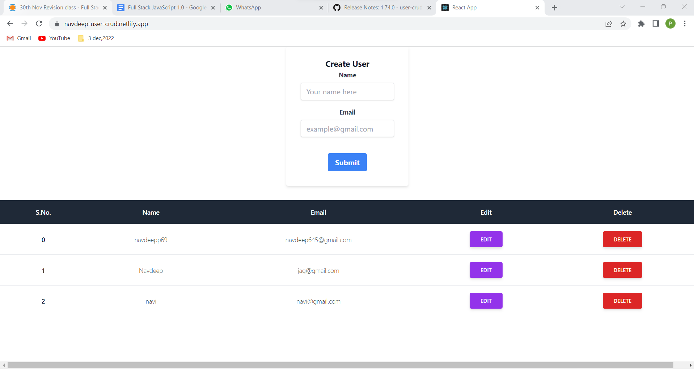

# User CRUD Operations Application

## Navdeep singh

### Technology Stack used -

- Backend
  - NodejS
  - Express js
  - MongoDB
- Frontend
  - HTML
  - CSS
  - Tailwind CSS
  - Javascript
  - React Js
- Deployment
  - Frontend - Netlify
  - Backend - Railway.app


### Using this application, we can -
### Create User, Edit User, Update User, Delete User




[Live Link](https://navdeep-user-crud.netlify.app/)
 

 ### API Designs

  #### Get All User API

 ```Javascript

 url - '/'

 ```

 #### Create User API

 ```Javascript

 url - '/create'

 json accepted -{

  "name":"string",
  "email":"string"
 }
 

 ```

 #### Edit User API

 ```Javascript

 url - '/editUser/:id'

 ```

  #### Delete User API

 ```Javascript

 url - '/deleteUser/:id'

 ```
